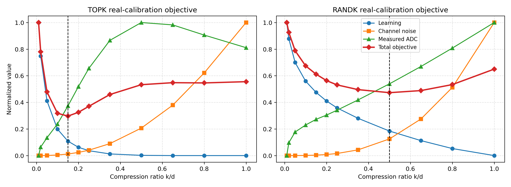
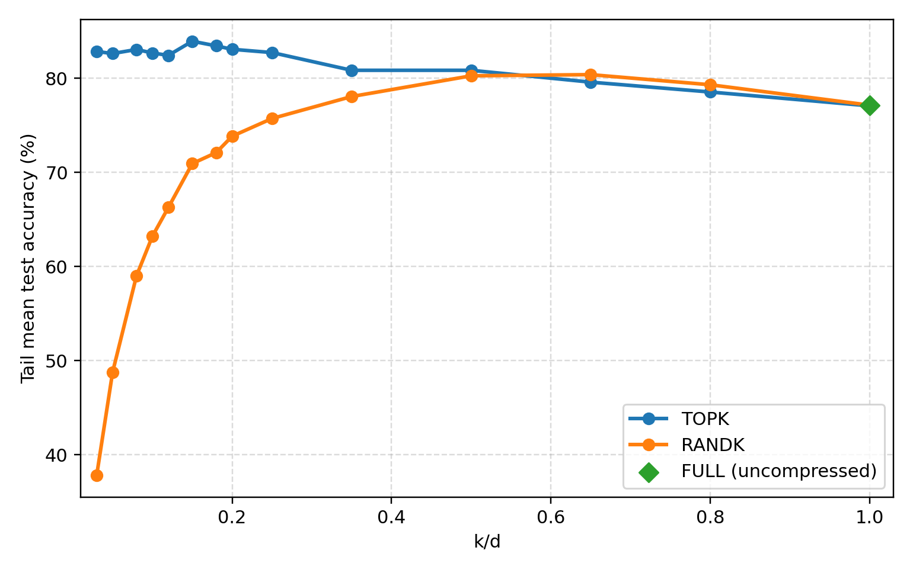
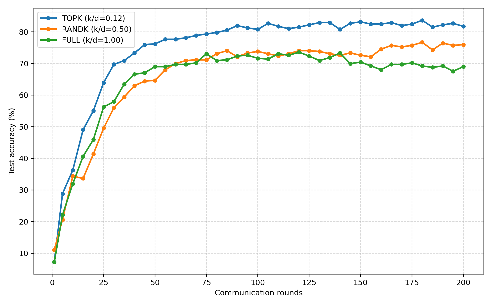
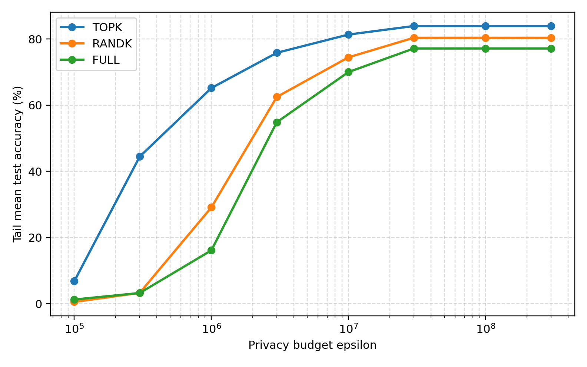
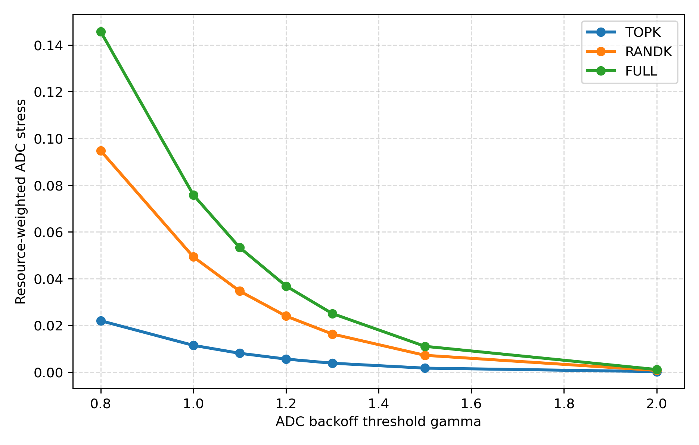
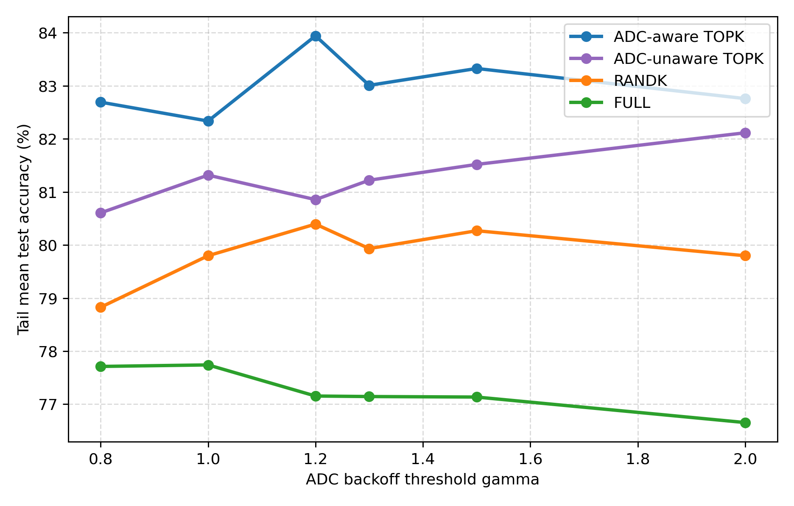

# Top-k AirComp-FL 阶段性实验汇报

本目录只保留当前可用于阶段汇报的实验 1-5：**6 张核心图、对应原始 CSV 和最小复现代码**。调参过程、训练日志、临时图和尚未迁移到统一场景的实验六均未放入。

## 一页结论

| 实验 | 核心问题 | 当前结果 |
|---|---|---|
| 实验一：离线一维搜索 | 理论目标能否给出合理的压缩率？ | ADC-aware Top-k 最优 `k/d=0.15`，Rand-k 最优 `k/d=0.50`；去掉 ADC 项后 Top-k 变为 `0.35`。 |
| 实验二：真实在线验证 | 离线工作点能否对应真实训练？ | 200 轮稳定工作点为 Top-k `0.15`、Rand-k `0.50-0.65`、Full `1.00`；各方法最优点的后 25 轮均值为 `83.94%/80.39%/77.15%`。 |
| 实验二：收敛性 | Top-k 是否收敛更快？ | Top-k 在第 `45` 轮达到 `75%`，Rand-k 为第 `165` 轮，Full 在 200 轮内未达到；后段形成明显三级差距。 |
| 实验三：隐私强度 | 强隐私约束下 Top-k 是否更稳？ | `epsilon=1e5` 时 Top-k/Rand-k/Full 为 `6.79%/0.51%/1.24%`；约 `3e7` 后进入平台区，并精确回到实验二的准确率水平。 |
| 实验四：ADC 硬件压力 | 稀疏传输是否降低 ADC 总体负担？ | `gamma=1.2` 时资源加权 ADC 压力约为 `0.00551/0.02394/0.03683`，Top-k 比 Rand-k 和 Full 分别低约 `77%` 和 `85%`。 |
| 实验五：ADC-aware 消融 | 目标函数中的 ADC 项是否必要？ | 锚点 `gamma=1.2` 时 ADC-aware Top-k 为 `83.94%`，ADC-unaware Top-k 为 `80.86%`，说明 ADC-aware 工作点选择带来 `3.08` 个百分点提升。 |

## 核心实验图

### 1. 离线目标函数与最优压缩率

蓝色学习误差随保留比例增加而下降，信道与 ADC 代价逐渐上升，总目标因此出现内部最优点。虚线对应 Top-k `0.15` 和 Rand-k `0.50`。



### 2. 在线压缩率验证

图中每个点均来自独立的 200 轮真实训练，不做插值或平滑。为降低第 200 轮单点评估波动，纵轴报告最后 25 轮的平均准确率。Top-k 在 `k/d=0.15` 达到稳定峰值 `83.94%`，随后下降；Rand-k 在 `0.50-0.65` 形成近似最优平台，其中 `0.65` 为 `80.39%`、`0.50` 为 `80.27%`。Full 没有可调压缩率，只在 `k/d=1` 显示一个真实训练点 `77.15%`。



### 3. 通信轮数与准确率

图中只连接每 5 轮得到的真实评估点，不插值补造训练数据。当前图仍来自上一版功率受限工作点；新的 `Pmax=2500, gamma=1.2` 场景需要按 Top-k `0.15`、Rand-k 候选平台重新生成后，才能与图 2 联合用于终稿结论。



### 4. 隐私预算与准确率

隐私预算较小时，隐私噪声占主导，Top-k 的低维传输优势最明显；预算放宽后，三种方法进入由收敛和功率约束主导的平台区。在 `epsilon=3e8` 时，后 25 轮均值为 `83.94%/80.39%/77.15%`，与实验二完全对应。



### 5. ADC 硬件压力

这里报告的是 `实测 ADC NMSE x 有效传输坐标比例`。原始 PAPR/ADC NMSE 在 AGC 下可能接近，但 Top-k 只传输更小的有效维度，因此总体硬件误差负担明显更低。主锚点 `gamma=1.2` 与实验二一致。



### 6. ADC-aware 稀疏率选择消融

ADC-aware Top-k 使用 `k/d=0.15`，ADC-unaware Top-k 使用去掉 ADC 项后得到的 `0.35`。前者在整个 gamma 扫描中均保持最高稳态准确率；在与实验二一致的 `gamma=1.2` 锚点，四种方案后 25 轮均值为 `83.94%/80.86%/80.39%/77.15%`。



## 数据与代码

- `结果数据/`：上述每张图对应的原始 CSV，包含离线目标、在线 sweep、逐轮准确率、隐私 sweep、ADC 压力和消融结果。
- `代码/exp/common/full_system.py`：统一的 FEMNIST、压缩、功率/隐私约束和 OFDM-ADC 训练主程序。
- `代码/exp/exp1-ksearch` 至 `代码/exp/exp5-adc-aware`：各实验的扫描脚本和后台启动脚本；`exp2-accuracy` 额外包含真实评估点收敛绘图脚本。

在仓库环境中可从代码快照目录重新运行：

```bash
cd 汇报/代码
PYTHON_BIN=../../quenv/bin/python bash exp/exp1-ksearch/run_exp1_ksearch.sh
PYTHON_BIN=../../quenv/bin/python bash exp/exp2.0-onlinesearch/run_exp2_common_grid.sh
PYTHON_BIN=../../quenv/bin/python bash exp/exp3-privacy/run_exp3_privacy_sweep.sh
PYTHON_BIN=../../quenv/bin/python bash exp/exp4-papr-adc/run_exp4_papr_adc.sh
PYTHON_BIN=../../quenv/bin/python bash exp/exp5-adc-aware/run_exp5_adc_aware.sh
```

默认使用 `cuda:3`，后台日志与新结果写入 `汇报/代码/logs/`，不会覆盖本目录已经归档的汇报图和 CSV。

## 汇报边界

- 当前正式结果均为固定随机种子 `2026` 的真实训练结果。它们适合阶段汇报，但论文最终统计仍需补充多随机种子均值和误差条。
- 实验一使用 calibration 场景：`epsilon=1e10, sigma0=0.01, Pmax=1e6, gamma=1.5`；更新后的实验二采用功率受限场景 `epsilon=3e8, sigma0=0.03, Pmax=2500, gamma=1.2`。Top-k 在线稳定点为 `0.15`，与离线结果一致；Rand-k 的 `0.50` 与 `0.65` 后 25 轮均值仅相差 `0.12` 个百分点。论文终稿前仍应在统一参数下重跑实验一并补充多随机种子统计。
- 实验三、四、五已经按实验二的 `Pmax=2500, gamma=1.2`、200 轮配置重跑并完成锚点校验。实验五除锚点外继续扫描 gamma 作为 ADC 消融变量。实验六仍使用 `gamma=1.0` 且缺少 `N=20` 锚点，尚不能宣称与实验二完全对齐。
- 实验四不应表述为“Top-k 在相同 k 下必然降低原始 PAPR”，可支持的结论是：在各方法自己的最优工作点上，Top-k 显著降低资源加权 ADC 硬件压力。
- 实验六已有单种子原始结果，但尚未迁移到新的功率受限统一场景，因此暂未加入本汇报目录。
